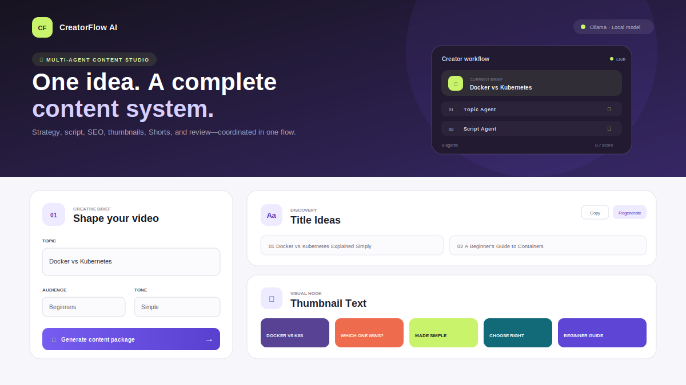

# CreatorFlow AI

CreatorFlow AI is a Ruflo-inspired multi-agent YouTube content assistant built
with FastAPI and React.



The complete application, setup guide, architecture, API documentation, and
interview explanation are in the
[CreatorFlow AI project README](creatorflow-ai/README.md).

## Quick start

```bash
cd creatorflow-ai/backend
python3 -m venv venv
source venv/bin/activate
pip install -r requirements.txt
cp .env.example .env
uvicorn main:app --reload --port 8000
```

In a second terminal:

```bash
cd creatorflow-ai/frontend
npm install
npm run dev
```

Open `http://localhost:5173`.

## Verification

```bash
LLM_PROVIDER=dummy creatorflow-ai/backend/venv/bin/python -m pytest creatorflow-ai/backend/tests -q
npm run build --prefix creatorflow-ai/frontend
```

Licensed under the [MIT License](LICENSE).
